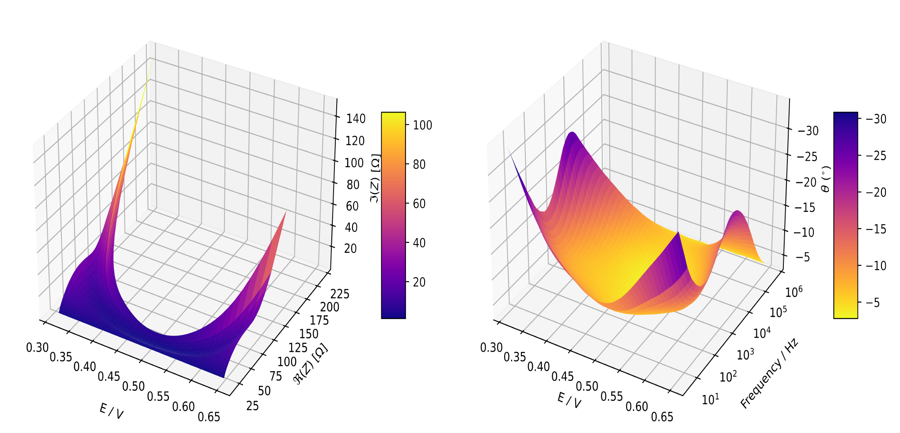

.. _batch-fit-vs-sequential-label:

=========================================
Batch fit vs sequential fit
=========================================

:code:`pymultieis` offers a ``fit_sequential()`` method for fitting individual spectra with or without a dependence.
It is based on the regular complex nonlinear least squares and uses the least-squares minimization algorithm
from the `Pytorch-minimize API <https://pytorch-minimize.readthedocs.io/en/latest/>`_ .
One advantage of ``fit_sequential()`` is that it can be use to fit a large
number of spectra. There is a caveat however, which is that it does not preserve the correlation between the parameters
especially when the model becomes more complex. Another limitation is the sensitivity of the least-squares method to
the initial guess.

The ``batch-fitting`` offered by :code:`pymultieis` overcome these limitations. They preserve the correlation between parameters
and are less sensitive to initial values - This makes it possible to use them as a method of obtaining reasonable initial guesses.

:code:`pymultieis` provides a Multieis class with methods for fitting, visualizing and saving the results thereafter.

1: Preseving correlation between parameters
===================================================

2. 1: Preseving correlation between parameters
===================================================

The ``fit_sequential()`` offers a possibility to fit only a subset of the total spectra based on the index of the spectra.