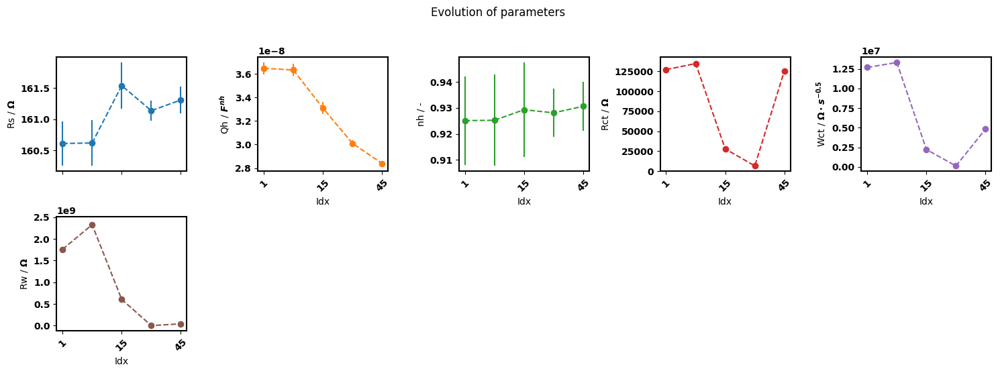

.. _batch-fit-vs-sequential-label:

=========================================
Batch fit vs sequential fit
=========================================

:code:`pymultieis` offers a ``fit_sequential()`` method for fitting individual spectra with or without a dependence.
It is based on the regular complex nonlinear least squares and uses the least-squares minimization algorithm
from the `Pytorch-minimize API <https://pytorch-minimize.readthedocs.io/en/latest/>`_ .
One advantage of ``fit_sequential()`` is that it can be use to fit a large
number of spectra. There is a caveat however, which is that it does not preserve the correlation between the parameters
especially when the model becomes more complex. Another limitation is the sensitivity of the least-squares method to
the initial guess.

The ``batch-fitting`` offered by :code:`pymultieis` overcome these limitations. Batch fitting here refers to the simulatneous fit
of all parameters offered by the ``fit_deterministic()``, ``fit_deterministic2()``, ``fit_stochastic()`` and ``fit_refine()`` methods.
These methods preserve the correlation between parameters and are slightly less sensitive to initial values
Thus it is possible to use the ``batch-fitting`` approaches to obtain reasonable initial guesses.

1: Preseving correlation between parameters
===================================================

For simple models, it is possible to observe tendencies of parameter changes using both ``fit_sequential()`` and the batch fit methods.
However as the model becomes more complicated or the spectra noisier, ``fit_sequential()`` loses the ability to preserve the correlation
between the parameters as can be observed in the parameter ``Rw``

a. Nyquist plot
*****************************

    A sequential fit on all spectra

    A batch fit

b. Parameter plot
*****************************

    A sequential fit on all spectra

.. figure:: _static/batch_params.png

    A batch fit

2. Fitting a subset of the batch
===================================================

The ``fit_sequential()`` offers a possibility to fit only a subset of the total spectra based on the index of the spectra.

.. code-block:: python

  popt, perr, chisqr, chitot, AIC = eis_redox_sequential.fit_sequential(indices=[1, 2, 15, 25, 45])
  eis_redox_sequential.plot_nyquist()
  eis_redox_sequential.plot_params(show_errorbar = False, labels = labels)

  A sequential fit on selected spectra

  Parameter trend obtained from sequential fit of selected spectra

The notebook for the above examples can be found in `batch-fit-vs-sequential-fit.ipynb <docs/source/examples/batch-fit-vs-sequential-fit.ipynb>`_ notebook